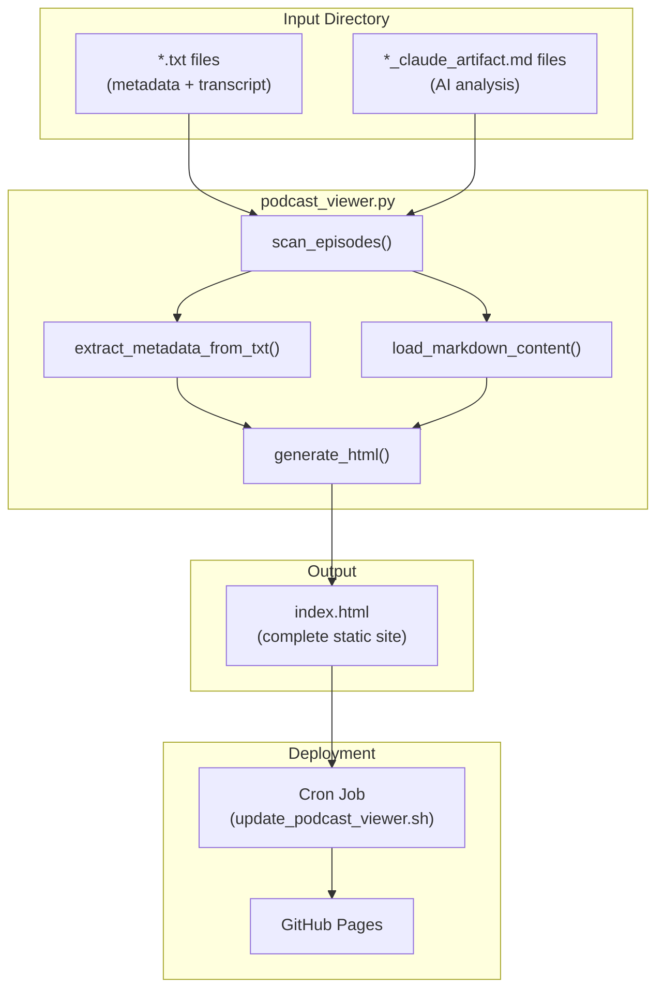
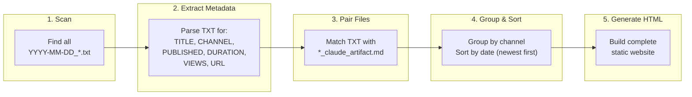
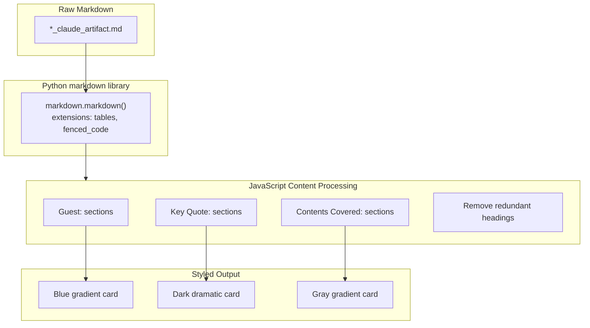
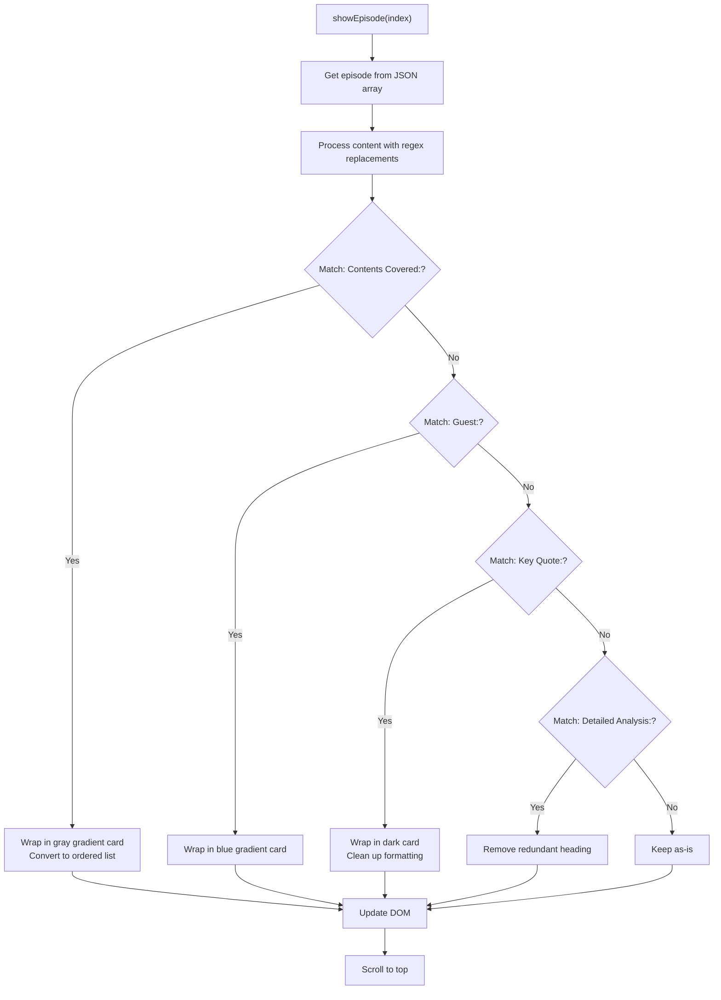
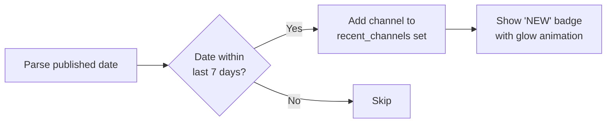
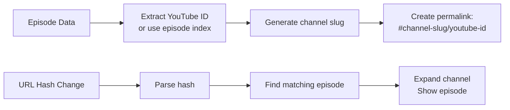
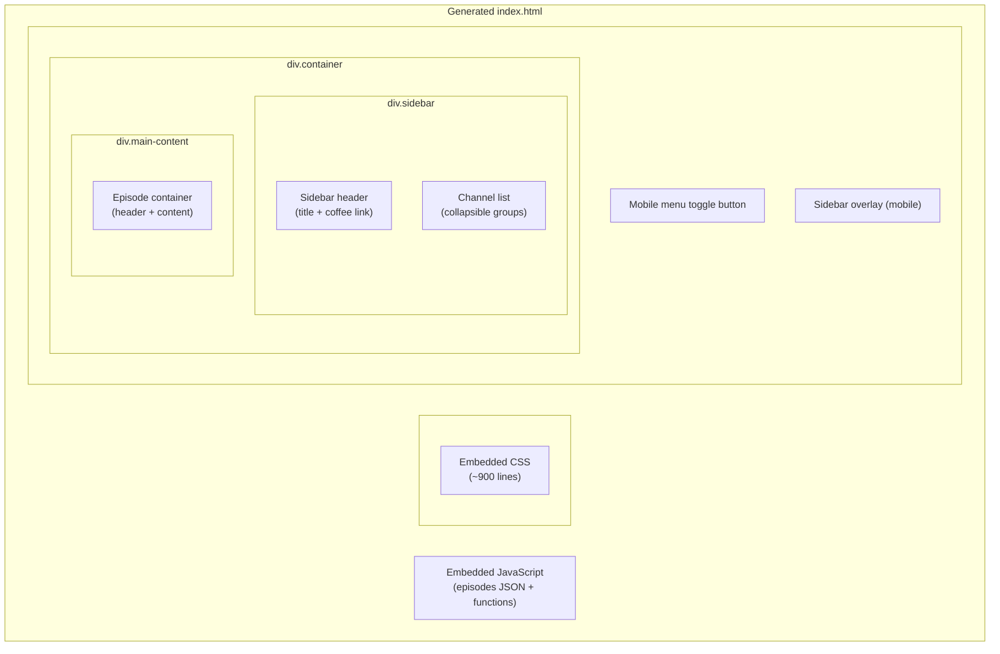
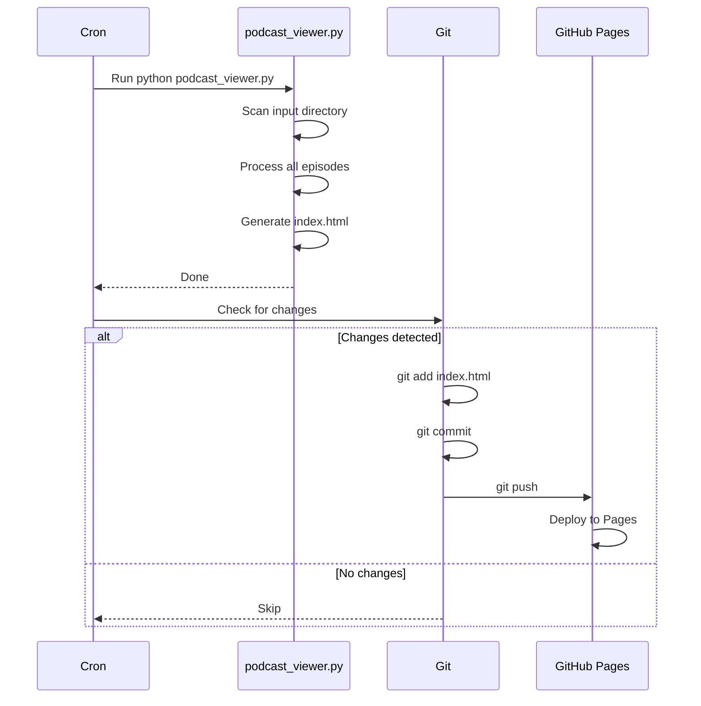

# Podcast Analysis Viewer

Live at: https://vibedatascience.github.io/podcast-analysis-viewer/

A static site generator that transforms podcast transcript files (`.txt`) and AI-generated analysis files (`.md`) into a beautiful, searchable web interface.

---

## System Architecture



---

## File Processing Pipeline



---

## TXT File Structure

The `.txt` files contain metadata headers followed by the raw transcript:

```
TITLE: Episode Title Here
CHANNEL: Podcast Channel Name
PUBLISHED: 2025-01-28
DURATION: 1:23:45
VIEWS: 123,456
URL: https://youtube.com/watch?v=xxxxx

[Raw transcript content below...]
```

### Metadata Extraction (Regex Patterns)

| Field | Regex Pattern | Example |
|-------|--------------|---------|
| Title | `TITLE:\s*(.+)` | `TITLE: How AI is Changing Everything` |
| Channel | `CHANNEL:\s*(.+)` | `CHANNEL: Lex Fridman` |
| Published | `PUBLISHED:\s*(.+)` | `PUBLISHED: 2025-01-28` |
| Duration | `DURATION:\s*(.+)` | `DURATION: 2:15:30` |
| Views | `VIEWS:\s*(.+)` | `VIEWS: 1,234,567` |
| URL | `URL:\s*(.+)` | `URL: https://youtube.com/watch?v=abc123` |

---

## MD File Processing

The `*_claude_artifact.md` files contain AI-generated analysis. The script converts markdown to HTML and applies special formatting:



---

## Content Transformation Rules

### 1. Guest Information

**Input (Markdown):**
```markdown
**Guest:** John Smith, CEO of TechCorp, AI researcher
```

**Output (Styled HTML):**
```html
<div style="background: linear-gradient(135deg, #eff6ff 0%, #dbeafe 100%);
            border: 1px solid #bfdbfe; border-radius: 12px; padding: 1.5rem;">
    <strong>Guest:</strong> John Smith, CEO of TechCorp, AI researcher
</div>
```

**Visual:** Light blue gradient card

---

### 2. Key Quotes

**Input (Markdown):**
```markdown
**Key Quote:** "The future of AI is not about replacing humans, it's about augmenting human capability."
```

**Output (Styled HTML):**
```html
<div style="background: linear-gradient(135deg, #1f2937 0%, #111827 100%);
            color: white; border-radius: 12px; padding: 2rem;
            font-style: italic; text-align: center;">
    "The future of AI is not about replacing humans..."
</div>
```

**Visual:** Dark dramatic card with white italic text

---

### 3. Contents Covered

**Input (Markdown):**
```markdown
**Contents Covered:**
1. Introduction to machine learning
2. Neural network architectures
3. Real-world applications
```

**Output (Styled HTML):**
```html
<div style="background: linear-gradient(135deg, #f3f4f6 0%, #e5e7eb 100%);
            border: 1px solid #d1d5db; border-radius: 12px; padding: 1.5rem;">
    <h3 style="color: #2563eb;">Contents Covered:</h3>
    <ol>
        <li>Introduction to machine learning</li>
        <li>Neural network architectures</li>
        <li>Real-world applications</li>
    </ol>
</div>
```

**Visual:** Gray gradient card with blue heading

---

### 4. Standard Markdown Elements

| Markdown | CSS Styling |
|----------|-------------|
| `# H1` | 24px, bold, margin-top: 36px |
| `## H2` | Primary blue, 2px bottom border |
| `### H3` | 17px, semi-bold |
| `> blockquote` | JetBrains Mono font, blue border, gray gradient |
| `**bold**` | font-weight: 600 |
| `*italic*` | Primary blue color |
| `***bold italic***` | Dark card with white text (key quote style) |

---

## JavaScript Content Processing Flow



---

## Recent Episodes Detection



**Supported Date Formats:**
- `%Y-%m-%d` (2025-01-28)
- `%d/%m/%Y` (28/01/2025)
- `%m/%d/%Y` (01/28/2025)
- `%B %d, %Y` (January 28, 2025)

---

## URL Permalink Structure



**Format:** `#channel-slug/youtube-id` or `#channel-slug/episode-N`

**Example:** `#lex-fridman/abc123xyz`

---

## HTML Generation Structure



---

## Cron Job Workflow



---

## File Structure

```
podcast-analysis-viewer/
├── .github/              # GitHub Actions workflows
├── .gitignore            # Ignored files (cron.log, venv, etc.)
├── .nojekyll             # Disable Jekyll processing
├── .trigger              # Cron trigger file
├── README.md             # This file
├── claude.md             # Development journal / instructions
├── index.html            # Generated static site (served by GitHub Pages)
├── podcast_viewer.py     # Main Python script
└── update_podcast_viewer.sh  # Shell script for cron updates
```

---

## Dependencies

- Python 3.x
- `markdown` library (with `tables` and `fenced_code` extensions)
- Standard library: `pathlib`, `re`, `json`, `datetime`
